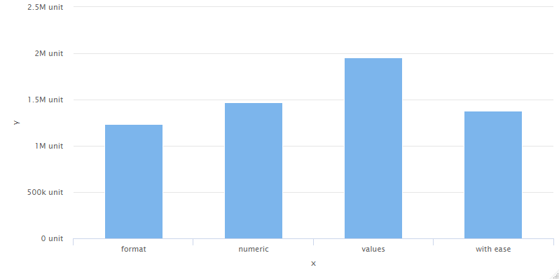
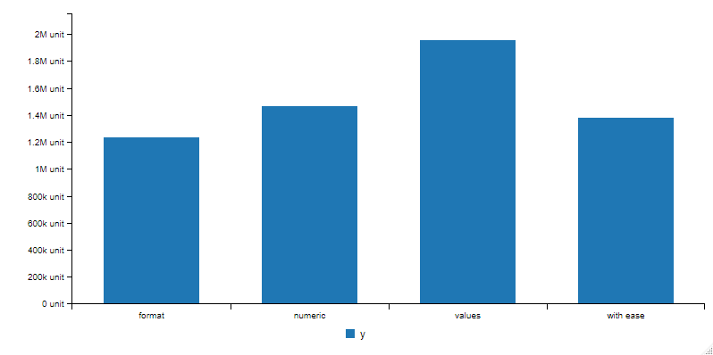

<!-- README.md is generated from README.Rmd. Please edit that file -->

```{r, include = FALSE}
knitr::opts_chunk$set(
  collapse = TRUE,
  comment = "#>",
  fig.path = "man/figures/README-",
  out.width = "100%"
)
```

# d3.format

> Interface to [d3.format](https://github.com/d3/d3-format) JavaScript library to format numbers for human consumption. The goal is to use the same way to format numbers in different htmlwidget packages such as [highcharter](https://github.com/jbkunst/highcharter), [apexcharter](https://github.com/dreamRs/apexcharter), [echarts4r](https://echarts4r.john-coene.com/) and more.

<!-- badges: start -->
[](https://www.tidyverse.org/lifecycle/#maturing)
[](https://github.com/dreamRs/d3.format/actions)
[](https://codecov.io/gh/dreamRs/d3.format?branch=master)
<!-- badges: end -->


## Installation

You can install the development version from [GitHub](https://github.com/) with:

``` r
# install.packages("devtools")
devtools::install_github("dreamRs/d3.format")
```


## Example

Format numbers like in d3 :

```{r example}
library(d3.format)

# thousand separator
d3_format(",")(1e9)

# Percentage
d3_format("%")(0.12)

# SI prefix
d3_format(".1s")(c(1e-3, 0, 1e3, 1e6, 1e9, 1e12))

# Currency
d3_format("$")(100)

# Fixed width and centered
d3_format("^20")(42)

# Use local
d3_format(",", locale = "fr-FR")(c(1e-3, 0, 1e3, 1e6, 1e9))
```


More examples [here](https://observablehq.com/@d3/d3-format).


## Format numbers on Htmlwidgets axis


With [highcharter](https://github.com/jbkunst/highcharter) :

```{r, eval=FALSE}
library(d3.format)
dat <- data.frame(
  x = c("format", "numeric", "values", "with ease"),
  y = c(1233172L, 1467863L, 1953877L, 1382088L)
)

library(highcharter)
hchart(dat, mapping = hcaes(x, y), type = "column") %>%
  use_d3_format() %>%
  hc_yAxis(labels = list(
    formatter = d3_format_js(",.3~s", suffix = " unit")
  ))

```



With [apexcharter](https://dreamrs.github.io/apexcharter/index.html) :

```{r, eval=FALSE}
library(apexcharter)
apex(dat, aes(x, y), "column") %>%
  use_d3_format() %>%
  ax_yaxis(labels = list(
    formatter =  d3_format_js(",.3~s", suffix = " unit")
  ))
```


With [billboarder](https://dreamrs.github.io/billboarder/index.html) :

```{r, eval=FALSE}
library(billboarder)
billboarder(data = dat) %>%
  bb_aes(x = x, y = y) %>%
  bb_barchart() %>%
  use_d3_format() %>%
  bb_y_axis(
    tick = list(
      format = d3_format_js(",.3~s", suffix = " unit")
    )
  )
```



With [echarts4r](https://echarts4r.john-coene.com/) :

```{r, eval=FALSE}
library(echarts4r)
dat %>%
  e_charts(x) %>%
  use_d3_format() %>%
  e_bar(y, name = "Serie 1") %>%
  e_y_axis(
    formatter = d3_format_js(",.3~s", suffix = " unit"),
    offset = -10
  )
```


You can also use it with [ggplot2](https://ggplot2.tidyverse.org/) :

```{r, eval=FALSE}
library(ggplot2)
ggplot(dat) + 
  geom_col(aes(x, y)) + 
  scale_y_continuous(labels = d3_format("$,.3~s"))
```


